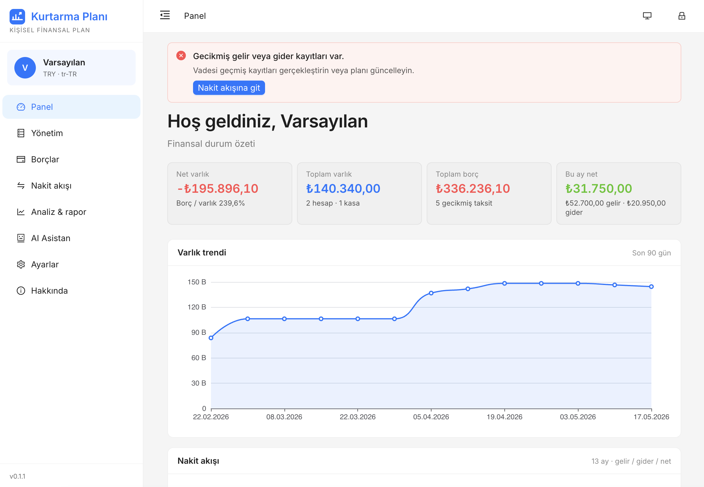
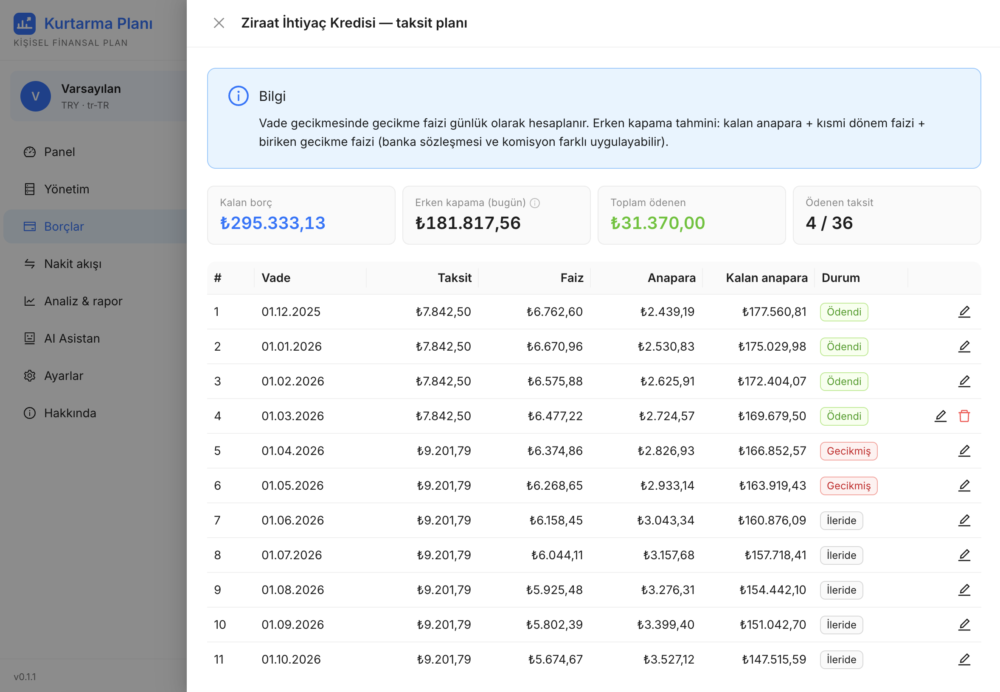
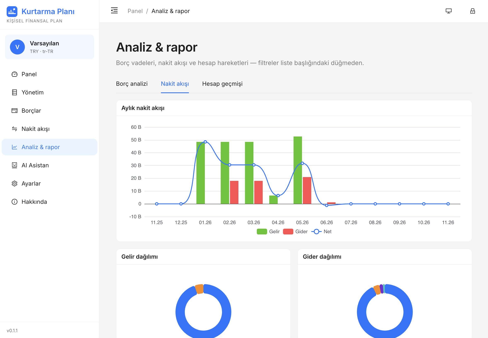
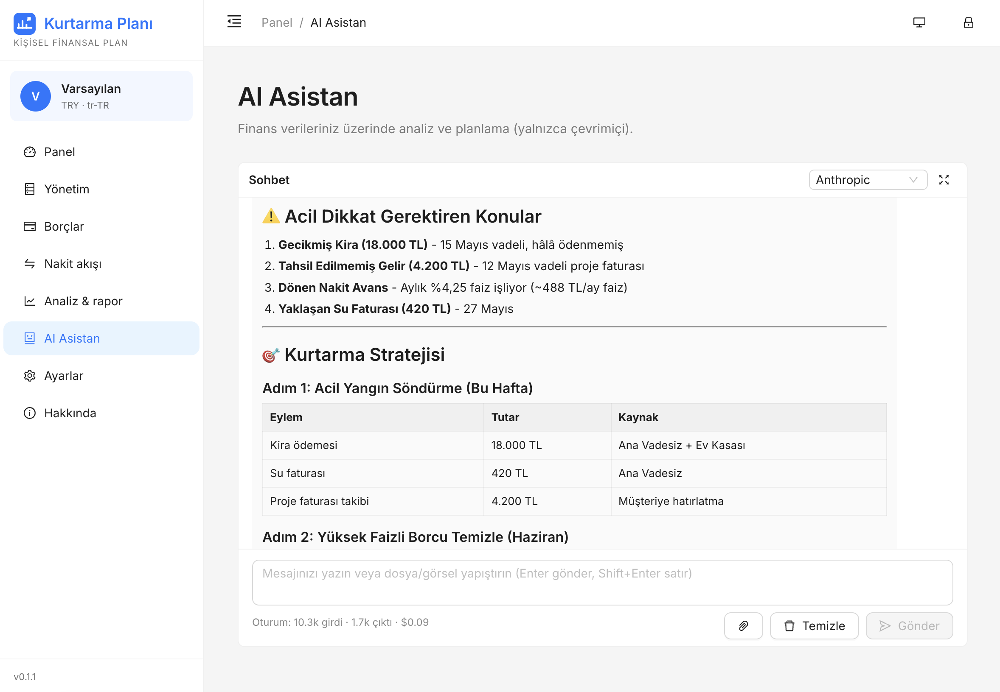
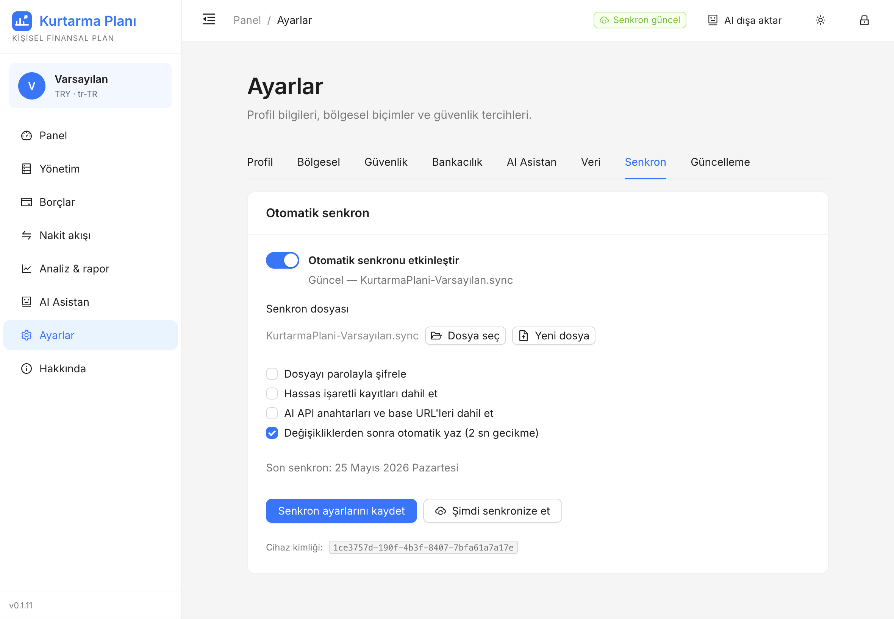
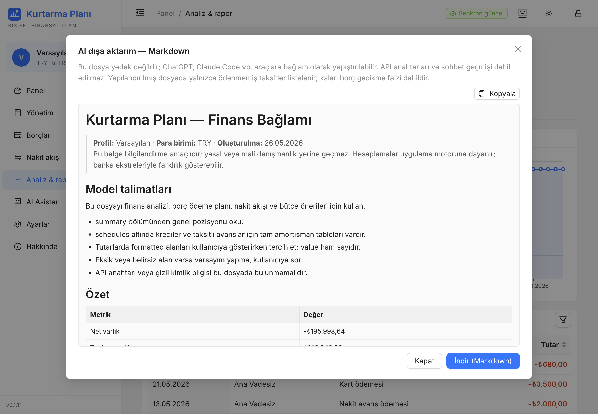

# Kurtarma Planı

[](package.json)
[](https://vuejs.org/)
[](https://www.typescriptlang.org/)
[](LICENSE)
[](https://buy.polar.sh/polar_cl_usN4UjpXleT4nGn3r2j2CcADPtdBvlvhCV3Em2Zhrxc)

Borçları kayıt altına alan, gelir-gider dengesini izleyen ve analiz eden **tek dosyalık statik SPA**. Backend yok; tüm veriler tarayıcıda **IndexedDB** üzerinde tutulur. Production çıktısı tek bir HTML dosyasıdır (`file://` ile açılabilir, çevrimdışı çalışır). Kurulum veya dosya indirme gerekmeden GitHub Pages üzerinde deneyebilirsiniz.

<p align="center">
  <a href="https://kurtar.co/">
    
  </a>
</p>

**Depo:** [github.com/kemalersin/kurtarma-plani](https://github.com/kemalersin/kurtarma-plani)  
**Canlı sürüm:** [kurtar.co](https://kurtar.co/) (`pages` dalı, CI ile otomatik; yedek: [github.io/kurtarma-plani](https://kemalersin.github.io/kurtarma-plani/))  
**İndir:** [pages/index.html](https://raw.githubusercontent.com/kemalersin/kurtarma-plani/pages/index.html) (Raw → kaydet, `file://`)  
**Kahve Ismarla:** [polar.sh](https://buy.polar.sh/polar_cl_usN4UjpXleT4nGn3r2j2CcADPtdBvlvhCV3Em2Zhrxc)

---

## Ekran görüntüleri

| Panel | Borçlar — taksit planı |
| --- | --- |
| Net varlık, varlık trendi ve aylık nakit akışı özeti | Kredi taksit tablosu, gecikme durumu ve erken kapama tahmini |
|  |  |

| Analiz & rapor | AI Asistan |
| --- | --- |
| Aylık nakit akışı, gelir ve gider dağılımı grafikleri | Finans özetine dayalı sohbet ve kurtarma stratejisi önerisi |
|  |  |

| Ayarlar — senkron | AI dışa aktar |
| --- | --- |
| Otomatik senkron dosyası, şifreleme ve cihazlar arası eşitleme | Finans bağlamı önizleme (Markdown / JSON) ve indirme |
|  |  |

---

## Hızlı başlangıç

1. Yukarıdaki **Canlı demo** düğmesinden uygulamayı açın — sunucu gerekmez.
2. Alternatif: [`pages` dalındaki `index.html`](https://raw.githubusercontent.com/kemalersin/kurtarma-plani/pages/index.html) dosyasını indirin (Raw → kaydet) ve `file://` ile açın.
3. İlk açılışta profil oluşturun veya yedek/senkron dosyasından geri yükleyin.

Geliştirici kurulumu için aşağıdaki [Geliştirme](#geliştirme) bölümüne bakın.

---

## Özellikler

### Çekirdek

| Alan | Açıklama |
|------|----------|
| **Çoklu profil** | Aynı tarayıcıda birden fazla izole finansal profil; profil seçimi ve kilitleme |
| **İsteğe bağlı parola** | PBKDF2 + AES-GCM ile profil verisi şifreleme; parola değişiminde yeniden şifreleme |
| **Bölgesel ayarlar** | Varsayılan `tr-TR` / TRY / Europe-Istanbul; locale, para birimi, timezone, tarih biçimi |
| **Offline-first** | Finans modülü internet olmadan tam işlevli; veriler yalnızca cihazınızda |

### Bankacılık & nakit akışı

- **Yönetim:** Bankalar, hesaplar, kasalar, gelir/gider türleri
- **Borçlar:** Kredi (anüite taksit planı), kredi kartı (dönem özeti), nakit avans (revolving ledger), taksitli nakit avans
- **Nakit akışı:** Planlı/gerçekleşmiş gelir, gider, transfer; borç karşılama analizi
- **Referans preset:** Türkiye bankacılık oranları build'de gömülü; çevrimiçiyken feed veya dosyadan güncellenebilir
- **Finans motoru:** Saf TypeScript (`src/finance/`), `decimal.js` + `date-fns-tz`; sözleşme oranı her zaman override edilebilir

### Analiz & rapor

- **Panel:** Net varlık, borç dağılımı, aylık nakit akışı, yaklaşan vadeler (ECharts)
- **Analiz sayfası:** Borç, nakit akışı ve hesap geçmişi sekmeleri; tarih/banka/kategori filtreleri

### Veri & senkron

- **Yedek:** JSON snapshot dışa/içe aktarma; opsiyonel dosya şifreleme
- **Hassas veri:** `sensitive` kayıtlar ve API anahtarları export'ta **kullanıcı onayı** ile
- **Otomatik senkron (M10):** Profil başına `.sync` dosyası; Chrome/Edge'de File System Access ile otomatik yazma/okuma; Safari ve sınırlı ortamlarda **manuel mod** (indir + dosya seç). iCloud/Dropbox klasörüne koyulabilir. Debounced push, periyodik/focus pull, çakışma çözümü. Ayrıntı: [docs/SYNC.md](docs/SYNC.md)
- **Kurulum geri yükleme:** Yedek veya senkron dosyasından profil kimliği (UUID) korunarak geri yükleme

### AI asistan (çevrimiçi)

- Anthropic, OpenAI, Gemini, DeepSeek, Ollama, vLLM; akışlı sohbet ve maliyet takibi
- Finans özetine dayalı **kayıt önerisi** (parse → onay → uygula)
- API anahtarları modele **gönderilmez**; hassas kayıtlar AI snapshot'ına **dahil edilmez**
- Görsel ve dosya ekleri (PDF, TXT, CSV, JSON)

### Güncelleme bildirimi

- GitHub `package.json` sürümü ile karşılaştırma (varsayılan açık)
- Yeni sürüm varsa üst bilgi bandı; indirme linki `pages` dalındaki `index.html` dosyasına yönlendirir
- Çevrimdışıyken kontrol yapılmaz

---

## Tarayıcı & dağıtım

| Konu | Not |
|------|-----|
| **Canlı sürüm** | [kurtar.co](https://kurtar.co/) — `main` push → `pages` dalına build |
| **Önerilen** | Chrome veya Edge (senkron dosyası seçici, File System Access) |
| **Safari / `file://`** | Finans tam çalışır; senkron **manuel mod** (indir + dosya seç) |
| **Build çıktısı** | Yerelde `dist/index.html`; repoda yalnızca `pages` dalında yayınlanır |
| **Hash routing** | `#/home`, `#/debts` … — History API kullanılmaz |

---

## Gizlilik

- Veriler **sunucuya gönderilmez** (AI sohbeti hariç — yalnızca sizin seçtiğiniz sağlayıcıya)
- Şifreleme isteğe bağlı; parola tarayıcı oturumunda tutulmaz (kilit ekranı)
- AI provider API anahtarları yalnızca IndexedDB'de; export ve modele gönderim kullanıcı kontrolünde

---

## Yasal uyarı

Bu uygulama bir banka veya finansal danışman değildir. Hesaplamalar ve analizler **yalnızca bilgilendirme ve kişisel planlama** amaçlıdır. Bağlayıcı sonuç için bankanızın sözleşmesi, ekstresi ve resmi mevzuat geçerlidir.

---

## Tech stack

| Katman | Seçim |
|--------|--------|
| Dil | TypeScript (strict) |
| UI | Vue 3 + Ant Design Vue 4 |
| Build | Vite 6 + vite-plugin-singlefile |
| Routing | Vue Router (hash) |
| State | Pinia |
| DB | Dexie (IndexedDB) |
| Şifreleme | Web Crypto API (PBKDF2 + AES-GCM) |
| Para | decimal.js |
| Tarih | date-fns + date-fns-tz |
| Grafik | Apache ECharts |
| Doğrulama | Zod |
| Test | Vitest |
| AI katalog | models.dev (build-time embed) |

---

## Geliştirme

```bash
npm install
npm run dev              # http://localhost:5173
npm run build            # → dist/index.html
npm run build:models     # Güncel models.dev kataloğu ile build
npm test                 # Vitest (finans motoru + yardımcılar)
npm run typecheck
```

`main` dalına her push'ta GitHub Actions derler ve `pages` dalına yazar; GitHub Pages bu dalı yayınlar. Yerel build: `npm run build` → `dist/index.html` (gitignore).

### Özel alan adı (`kurtar.co`)

| Tür | Host | Değer |
|-----|------|--------|
| **A** | `@` | `185.199.108.153` |
| **A** | `@` | `185.199.109.153` |
| **A** | `@` | `185.199.110.153` |
| **A** | `@` | `185.199.111.153` |
| **CNAME** | `www` | `kemalersin.github.io` |

- Repo → **Settings → Pages → Custom domain:** `kurtar.co` (DNS yeşil olunca **Enforce HTTPS** açılır).
- `public/CNAME` yalnızca `kurtar.co` içerir (GitHub tek satır ister; `www` yalnızca DNS CNAME).
- HTTPS gelmezse: Custom domain’i kaldırıp yeniden ekleyin; 1 saate kadar bekleyin.

---

## Proje yapısı (özet)

```
src/
  finance/          Saf TS finans motoru
  features/         Sayfa modülleri (debts, cashflow, analytics, ai, …)
  core/
    db/             Dexie meta + profil DB
    services/sync/  Otomatik senkron (KP-SYNC1)
  components/       Paylaşılan UI (EntityListPage, FormDrawer, …)
docs/               Wiki, mimari, senkron tasarımı
.github/workflows/  CI — main → pages dalı deploy
```

---

## Belgeler

| Belge | İçerik |
|-------|--------|
| [docs/WIKI.md](docs/WIKI.md) | İlk gereksinimler (eksiksiz) |
| [docs/ARCHITECTURE.md](docs/ARCHITECTURE.md) | Mimari kararlar |
| [docs/SYNC.md](docs/SYNC.md) | Otomatik senkron dosyası (M10) |
| [docs/BANKING-TR.md](docs/BANKING-TR.md) | Türkiye bankacılık referans preset |
| [TODO.md](TODO.md) | Milestone ve görev listesi |
| [CHANGELOG.md](CHANGELOG.md) | Sürüm geçmişi |
| [LICENSE](LICENSE) | Lisans ve dağıtım koşulları |

---

## Proje durumu

| Milestone | Durum |
|-----------|--------|
| M1–M3 | İskelet, veri katmanı, yönetimsel veriler |
| M4–M5 | Kredi, kart, nakit/taksitli avans |
| M6 | Gelir, gider, transfer |
| M7 | Panel + analiz sayfası (Excel/PDF export ertelendi) |
| M8 | AI sohbet, öneri, ekler |
| M9 | Birim testleri; E2E / bundle optimizasyonu bekliyor |
| M10 | Otomatik senkron S1–S5 tamam; WebDAV (S6) opsiyonel |

**Sürüm:** [`0.1.19`](package.json) (`package.json`; canlı derlemede **Hakkında** ekranında görünür).

---

## Lisans

Kaynak kod [LICENSE](LICENSE) dosyasındaki koşullara tabidir.

**Derlenmiş dağıtım (`pages` dalı / GitHub Pages):** Tek dosyalık çıktı, uygulama içindeki **Hakkında** (`#/about`) ekranındaki bilgiler (sürüm, özellik özeti, açık kaynak/GitHub bağlantısı, teknik özet, yasal uyarı, destek bağlantısı vb.) **silinerek veya gizlenerek dağıtılamaz**. Kaynak kodu değiştirip yeniden derleseniz bile bu ekranın içeriği korunmalıdır.

---

## Katkı & destek

Hata bildirimi ve öneriler [GitHub Issues](https://github.com/kemalersin/kurtarma-plani/issues) üzerinden yapılabilir. Projeyi beğendiyseniz [Kahve Ismarla](https://buy.polar.sh/polar_cl_usN4UjpXleT4nGn3r2j2CcADPtdBvlvhCV3Em2Zhrxc) ile destekleyebilirsiniz (uygulama içi: **Hakkında**).
