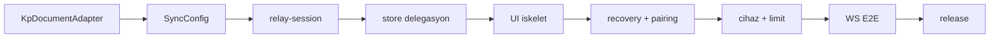

# Kurtarma Planı — Envelope Sync Relay (ESR) Entegrasyon Planı

Bu belge, **Kurtarma Planı** (KP) uygulamasına [Senkronla](https://github.com/kemalersin/senkronla) tabanlı **Envelope Sync Relay (ESR)** senkronizasyonunun nasıl ekleneceğini tanımlar.

**Hedef okuyucu:** geliştirici ve AI coding agent.  
**Kapsam dışı:** relay sunucusu kurulumu (operatör işi — [Senkronla ESR setup](http://localhost:3000/guides/esr)).

---

## 1. Özet

| Konu | Karar |
|------|--------|
| Transport | Mevcut **dosya** (`KP-SYNC1`) korunur; yeni **relay** (`ESR-DOC1` / `ENV-ENC1`) alternatif |
| Aynı anda | Bir profil **yalnızca bir** transport kullanır (`file` **veya** `relay`) |
| SDK | `@senkronla/client` — **`EsrSync.connect()`** facade (önerilen yol) |
| Namespace | `ProfileMeta.id` (UUID) — `generateNamespaceId()` **kullanılmaz** |
| Belge | `documentId: primary` (tek snapshot; v1.2 çoklu belge gerekmez) |
| İçerik | Mevcut `buildSnapshot` / `importSnapshot` — şema değişmez |
| Offline-first | Korunur; relay yalnızca çevrimiçiyken I/O |
| Bağımlılık | `@senkronla/client` + `@senkronla/protocol` (^0.1.9, npm veya dev alias) |

---

## 2. Mevcut durum

### 2.1 Tamamlanan: M10 dosya senkronu

Tasarım: [SYNC.md](./SYNC.md). Fazlar S1–S5 **tamamlandı**.

| Modül | Durum |
|-------|--------|
| `src/core/types/sync.ts` | `SyncConfig`, `KP-SYNC1` zarf |
| `src/core/services/sync/sync-file.ts` | Okuma/yazma, handle store |
| `src/core/services/sync/sync-engine.ts` | Push/pull, çakışma |
| `src/core/services/sync/sync-scheduler.ts` | Debounce 2 sn, 45 sn poll |
| `src/stores/sync.ts` | Pinia store |
| `src/components/SyncSettingsSection.vue` | Ayarlar → Veri UI |

Entity kayıtları sonrası `notifySyncLocalChange()` → debounced push. Çakışmada kullanıcı **yerel / uzak** seçer (otomatik merge yok).

### 2.2 Henüz yok

- `@senkronla/client` runtime kullanımı (`package.json`'da bağımlılık var, `src/` içinde import yok)
- Relay transport, `EsrSync`, cihaz eşleştirme, recovery phrase UX
- `SyncConfig.transport` alanı

---

## 3. Hedef mimari

```
┌──────────────────────────────────────────────────────────────────┐
│ Kurtarma Planı (Vue 3 + Dexie + Pinia)                           │
│  buildSnapshot / importSnapshot     ← değişmez                   │
│  KpDocumentAdapter                  ← yeni ince köprü              │
│  useSyncStore                       ← transport delegasyonu      │
└───────────────┬──────────────────────────────┬───────────────────┘
                │                              │
     transport=file                    transport=relay
                │                              │
┌───────────────▼──────────────┐   ┌───────────▼──────────────────┐
│ sync-file / sync-engine      │   │ relay-session.ts             │
│ KP-SYNC1 zarf                │   │ EsrSync.connect()            │
│ FS Access / manual mod       │   │ @senkronla/client            │
└───────────────┬──────────────┘   └───────────┬──────────────────┘
                │                              │
                ▼                              ▼
         iCloud / Dropbox              ESR HTTP + WebSocket
         (kullanıcı klasörü)            (self-hosted relay)
```

**İlke:** Snapshot üretimi ve içe aktarma **tek kaynak** (`snapshot.ts`). Relay yalnızca taşıma katmanı değiştirir; finans motoru ve entity store'lara dokunulmaz.

---

## 4. Kavram eşlemesi

| Kurtarma Planı | ESR / Senkronla |
|----------------|-----------------|
| `ProfileMeta.id` | `namespaceId` |
| `ProfileMeta.name` | `namespaceLabel` |
| `buildSnapshot()` çıktısı | `DocumentAdapter.buildDocument()` JSON gövdesi |
| `importSnapshot({ overwriteProfileId })` | `DocumentAdapter.importDocument()` |
| `AppMeta.deviceId` | Envelope `deviceId` + ESR `clientDeviceId` |
| `SyncConfig` | Genişletilir: `transport`, `relayUrl`, `appId`, … |
| Dosya sync (`KP-SYNC1`) | `transport: 'file'` |
| Relay sync | `transport: 'relay'` |
| `SyncConflictModal` | ESR `onConflict` → aynı UX |
| Profil parolası (`dataKey`) | Snapshot iç şifre çözümü — relay'e **gönderilmez** |
| Senkron parolası (`encryptFile`) | KP dosya zarfı (`KP-ENC1`) **veya** ESR `ENV-ENC1` |
| ESR recovery phrase (24 kelime) | Namespace erişim kanıtı — profil parolasından **ayrı** |

**Namespace doğrulama:** Profil id zaten UUID v4; `isValidNamespaceId(profile.id)` yeterli.

**contentType:**

```
application/vnd.kurtarma-plani.snapshot+json
```

---

## 5. Üç parola / anahtar ayrımı

KP entegrasyonunda üç bağımsız sır vardır. UX ve dokümantasyonda karıştırılmamalıdır.

| Sır | Amaç | Relay'e gider mi? | Cihazlar arası |
|-----|------|-------------------|----------------|
| **Profil parolası** | IndexedDB entity şifreleme (`dataKey`) | Hayır | Export/import ile taşınır (wrapped key) |
| **Senkron parolası** | Snapshot zarf şifreleme (`KP-ENC1` veya `ENV-ENC1`) | Hayır (yalnızca şifreli payload) | Kullanıcı tüm cihazlarda **aynı parolayı** girmeli — SDK otomatik taşımaz |
| **Recovery phrase** | Namespace kurtarma / tüm cihaz iptali | Hayır (yalnızca hash kanıtı) | Kullanıcı offline saklar; bir kez gösterilir |

**MVP kararı:** ESR recovery phrase, profil kurulumunda veya ilk relay bağlantısında **ayrı** üretilir ve gösterilir. Profil parolası ile birleştirilmez.

---

## 6. Şifreleme katmanları

### 6.1 Dosya transport (mevcut)

```
KP-SYNC1 (plain meta: rev, sha256, profileId)
  └── payload: KP-RAW1 | KP-ENC1
        └── ExportSnapshot (kurtarma-plani-export)
```

### 6.2 Relay transport (yeni)

```
ESR-DOC1 (relay meta: revision, documentId)
  └── payload: ENV-RAW1 | ENV-ENC1    ← @senkronla/protocol
        └── ExportSnapshot JSON (aynı içerik)
```

**Öneri:** Relay path'te `createDocumentAdapter({ encrypt: true, resolvePassword })` kullan; inner snapshot **düz JSON** (`buildSnapshot` with `encryptFile: false`). Çift şifreleme (KP-ENC1 içinde ENV-ENC1) gereksizdir.

Dosya transport mevcut `KP-ENC1` mantığını korur; relay transport `ENV-ENC1` kullanır. İki format birbirine dönüştürülmez — transport değişince yeni head kaynağından pull yapılır.

---

## 7. KpDocumentAdapter

```typescript
// src/core/services/sync/kp-document-adapter.ts

import { createDocumentAdapter } from '@senkronla/client'
import { buildSnapshot, importSnapshot } from '@/core/services/snapshot'
import { ExportSnapshotSchema } from '@/core/types/export'
import type { ProfileMeta } from '@/core/types/profile'
import type { SyncConfig } from '@/core/types/sync'

export const KP_CONTENT_TYPE = 'application/vnd.kurtarma-plani.snapshot+json'

export interface KpAdapterContext {
  profile: ProfileMeta
  dataKey: CryptoKey | null
  syncOptions: Pick<SyncConfig, 'includeSensitive' | 'includeSecrets'>
  resolveSyncPassword: () => Promise<string | undefined>
}

export function createKpDocumentAdapter(ctx: KpAdapterContext) {
  return createDocumentAdapter({
    namespaceId: ctx.profile.id,
    namespaceLabel: ctx.profile.name,
    contentType: KP_CONTENT_TYPE,
    encrypt: true,
    resolvePassword: ctx.resolveSyncPassword,
    exportDocument: async () => {
      const snapshot = await buildSnapshot(
        {
          includeSensitive: ctx.syncOptions.includeSensitive,
          includeSecrets: ctx.syncOptions.includeSecrets,
          encryptFile: false,
        },
        { profile: ctx.profile, key: ctx.dataKey },
      )
      return snapshot
    },
    importDocument: async (json) => {
      const parsed = ExportSnapshotSchema.parse(json)
      await importSnapshot(parsed, {
        overwriteProfileId: ctx.profile.id,
        dataKey: ctx.dataKey,
      })
    },
  })
}
```

**Kurallar:**

- `chatSession` zaten `buildSnapshot`'ta hariç — değişiklik gerekmez
- `includeSecrets: false` varsayılan — API anahtarları relay'e gitmez (KP politikası)
- `includeSensitive: false` varsayılan — export onayı ile açılır
- Pull sonrası `reloadStoresAfterSyncPull()` (mevcut) çağrılır

---

## 8. Relay oturumu (`EsrSync`)

```typescript
// src/core/services/sync/relay-session.ts — pseudocode

import { EsrSync, createLocalStorageAdapter } from '@senkronla/client'
import { createKpDocumentAdapter } from './kp-document-adapter'

export async function connectRelaySession(params: {
  relayUrl: string
  appId?: string
  profile: ProfileMeta
  dataKey: CryptoKey | null
  syncConfig: SyncConfig
  resolveSyncPassword: () => Promise<string | undefined>
  onRecoveryPhrase: EsrSyncConnectOptions['onRecoveryPhrase']
  onConflict: EsrSyncConnectOptions['onConflict']
  onStatusChange?: EsrSyncConnectOptions['onStatusChange']
}): Promise<EsrSync> {
  const adapter = createKpDocumentAdapter({ ... })
  const storageKey = `kp-esr.${params.profile.id}`

  return EsrSync.connect({
    relayUrl: params.relayUrl,
    appId: params.syncConfig.appId,
    document: adapter,
    storage: createLocalStorageAdapter(storageKey),
    pushDebounceMs: 2000,
    onRecoveryPhrase: params.onRecoveryPhrase,
    onConflict: params.onConflict,
    onStatusChange: params.onStatusChange,
    onDeviceLimit: params.onDeviceLimit,
    onError: (err) => { /* log, syncStore.lastError */ },
  })
}
```

**Yaşam döngüsü (Senkronla agent rehberi ile uyumlu):**

1. Profil kilidi açıldı + `transport === 'relay'` + `enabled` → `connectRelaySession`
2. `ensureNamespace()` → ilk kurulumda recovery phrase modal
3. `sync()` — tam pull/push
4. Entity değişikliği → `notifyLocalChange('primary')` (mevcut scheduler'dan)
5. Profil kilidi / sekme kapanışı → `flushPush()`
6. Profil değişimi → mevcut oturumu `disable()`, yeni profil için yeniden `connect`

**Depolama:** `createLocalStorageAdapter('kp-esr.<profileId>')` — `deviceToken`, `knownRemoteRevision` SDK yönetir. Mobilde ileride Keychain/Keystore `EsrStorage` implementasyonu değerlendirilir.

---

## 9. SyncConfig genişlemesi

`src/core/types/sync.ts` — meta DB **version(7)** migration:

```typescript
export type SyncTransport = 'file' | 'relay'

export const SyncConfigSchema = z.object({
  // ... mevcut alanlar (enabled, encryptFile, includeSensitive, …)
  transport: z.enum(['file', 'relay']).default('file'),
  relayUrl: z.string().url().optional(),
  /** Relay app registry (v1.3) — GET /health → apps.enabled ise zorunlu */
  appId: z.string().optional(),
  /** Profil başına relay bağlantı durumu (UI) */
  relayConnectedByProfile: z.record(z.string(), z.boolean()).optional(),
})
```

| Alan | file | relay |
|------|------|-------|
| `fileNameByProfile` | Gerekli (handle/manual) | Kullanılmaz |
| `remoteRevisionByProfile` | KP-SYNC1 rev | SDK `EsrStorage` yönetir (yedek meta opsiyonel) |
| `relayUrl` | — | `/v1` ile bitmeli |
| `appId` | — | Registry açıksa zorunlu |

`enabled: false` iken transport fark etmez; I/O yok.

**Transport değiştirme:** Kullanıcıya uyarı — farklı head kaynağı; son senkron transport'undan devam eder. İsteğe bağlı: «Relay'e geç» sihirbazı ilk `ensureNamespace` + pairing.

---

## 10. useSyncStore ve scheduler

Mevcut store korunur; transport delegasyonu eklenir:

```typescript
async function pushOnly() {
  if (config.transport === 'relay') {
    await relaySession?.flushPush('primary')
    return
  }
  return runPushSync(/* mevcut */)
}

async function pullIfEnabled() {
  if (config.transport === 'relay') {
    const result = await relaySession?.sync('primary')
    // Pull varsa `KpDocumentAdapter.onAfterImport` → reloadStores + onRemotePull
    return result?.status === 'ok' && result.reloaded
  }
    return result?.status === 'ok'
  }
  return runPullSync(/* mevcut */)
}
```

**Scheduler (`sync-scheduler.ts`):**

| Olay | file | relay |
|------|------|-------|
| `notifySyncLocalChange` | debounced `pushOnly` | `relaySession.notifyLocalChange('primary')` |
| `flushSyncPushNow` | `pushOnly` | `relaySession.flushPush('primary')` |
| Pull (bootstrap/focus) | `pullIfEnabled` | `relaySession.sync('primary')` |
| Periyodik poll (45 sn) | Dosya rev kontrolü | WS kopukken SDK poll fallback |
| `navigator.onLine` | Sessiz hata | `offline` status — UI rozeti |

**Relay-specific Pinia state:**

- `relaySession: EsrSync | null` (profil başına cache veya tek aktif)
- `esrDevices` — `listDevices()` sonucu (Ayarlar UI)
- `pairingCode` — geçici host pairing

Mevcut korunan: `SyncConflictModal`, `pullRevision`, `markLocalMutation`, profil mismatch kontrolü (file-only).

---

## 11. UI planı

Konum: **Ayarlar → Veri** — mevcut `SyncSettingsSection` genişletilir.

### 11.1 Transport seçimi

```
Senkron yöntemi:
  ( ) Dosya (iCloud / Dropbox klasörü)     ← mevcut
  ( ) Envelope Sync Relay                  ← yeni
```

Transport değişince alt form alanları koşullu gösterilir.

### 11.2 Relay alt bölümü

| Bileşen | Açıklama |
|---------|----------|
| Sunucu adresi | `https://sync.example.com/v1` — Zod URL doğrulama |
| Uygulama kimliği | `appId` — registry açık relay'lerde |
| Bağlan | `ensureNamespace()` + ilk sync |
| Durum rozeti | Mevcut rozetler + `ws_connected`, `offline` |
| Cihaz listesi | `listDevices()` — etiket, revoke |
| Cihaz ekle | `startPairing()` → 6 haneli kod + QR payload |
| Cihaza katıl | `joinPairing(code)` — misafir cihaz |
| Recovery anahtarı | «Recovery anahtarını göster» — yalnızca kayıtlı phrase varsa |
| Slot / unlock | `DEVICE_LIMIT_*` → modal + `redeemUnlockCode` |

Şifreleme, hassas veri ve AI anahtarı seçenekleri **her iki transport'ta aynı** (`buildSnapshot` options).

### 11.3 ESR hata → KP UI

| Kod | Aksiyon |
|-----|---------|
| `REVISION_CONFLICT` | Mevcut `SyncConflictModal` |
| `DEVICE_LIMIT_PAYMENT_REQUIRED` | `SyncUnlockModal` — paket / unlock kodu |
| `DEVICE_LIMIT_BLOCKED` | Alert — cihaz kaldırın |
| `ESR_CLIENT_NO_TOKEN` | «Bağlan» / pairing yönlendir |
| `DEVICE_TOKEN_INVALID` | Senkron sıfırla + recovery |
| `ESR_CLIENT_OFFLINE` | Rozet + çevrimdışı açıklama |

### 11.4 Navbar rozeti

Mevcut `useSyncStore.runtimeStatus` genişletilir; relay `EsrSyncStatus` değerleri eşlenir.

---

## 12. Güvenlik ve veri politikası

KP çekirdek kuralları relay path'te de geçerlidir:

| Kural | Uygulama |
|-------|----------|
| `sensitive: true` kayıtlar | Varsayılan hariç; kullanıcı onayı ile |
| API anahtarları | `includeSecrets: false` — relay'e **asla** |
| `chatSession` | Snapshot'a dahil değil |
| AI snapshot | ESR yoluna **dahil değil** |
| Loglama | Envelope, token, parola loglanmaz |
| Offline-first | Relay I/O yalnızca online; finans modülü etkilenmez |

CORS ve app registry: web SPA `Origin` header'ı otomatik; operatör relay'de origin kaydı gerekir.

---

## 13. App registry (ESR v1.3)

Relay operatörü `apps.enabled: true` ise:

```http
X-ESR-App-Id: esr_app_kurtarma_plani
Origin: https://app.example.com
```

KP build'inde varsayılan `appId` **boş**; kullanıcı veya dağıtım `.env` ile override:

```
VITE_ESR_APP_ID=esr_app_kurtarma_plani
VITE_ESR_RELAY_URL=https://sync.example.com/v1
```

Yerel geliştirme: operatör `allowLocalhostOrigins: true`; `http://localhost:5173` kayıtlı origin.

Spec: [16-APP-REGISTRY.md](https://github.com/kemalersin/senkronla/blob/main/docs/envelope-sync-relay/en/16-APP-REGISTRY.md)

---

## 14. Profil başına izolasyon

KP çoklu profil destekler:

```
Profil A (uuid-a) → namespace uuid-a, ayrı EsrSync storage, ayrı deviceToken
Profil B (uuid-b) → namespace uuid-b, …
```

Profil değişiminde:

1. Aktif `relaySession?.disable()`
2. `onActiveProfileChanged()` (mevcut file handle switch)
3. Yeni profil unlocked + relay enabled → yeni `connectRelaySession`

---

## 15. Bağımlılıklar ve build

```json
{
  "@senkronla/client": "^0.1.9",
  "@senkronla/protocol": "^0.1.9"
}
```

**Dev alias** (mevcut `vite.config.ts`):

```typescript
// SENKRONLA_ROOT=../senkronla, VITE_LOCAL_SENKRONLA_PACKAGES !== 'false'
'@senkronla/client' → packages/client/src
'@senkronla/protocol' → packages/protocol/src
```

**Build kısıtları korunur:**

- Tek HTML bundle (`vite-plugin-singlefile`)
- Hash routing
- Runtime CDN yok — SDK build'e gömülür
- Bundle boyutu: `@senkronla/client` tree-shake; faz KP-R7'de ölçüm

---

## 16. Geliştirme fazları

ESR relay servisi ayrı repoda (Senkronla). KP entegrasyonu relay v1.2+ hazır olduktan sonra:

| Faz | İş | Çıktı | Bağımlılık |
|-----|-----|-------|------------|
| **KP-R1** | `KpDocumentAdapter` + unit test (mock snapshot round-trip) | `kp-document-adapter.ts`, spec | — |
| **KP-R2** | `SyncConfig.transport`, `relayUrl`, `appId`; meta v7 migration | `sync.ts`, `meta.ts` | — |
| **KP-R3** | `relay-session.ts` — `EsrSync.connect`, `ensureNamespace`, `sync` | Temel relay push/pull | Yerel relay docker |
| **KP-R4** | `useSyncStore` transport delegasyonu; scheduler relay dalı | File regression yeşil | KP-R3 |
| **KP-R5** | `SyncSettingsSection` transport toggle + relay URL + bağlan | UI iskelet | KP-R4 |
| **KP-R6** | Recovery phrase modal; pairing host/guest UI | `SyncPairingDrawer` | ESR pairing API |
| **KP-R7** | Cihaz listesi, revoke, limit/unlock modal | `SyncDeviceList`, `SyncUnlockModal` | ESR slot API |
| **KP-R8** | WS bildirim + poll fallback; 2 cihaz E2E | Notification entegrasyonu | ESR WS |
| **KP-R9** | Bundle ölçümü, `CHANGELOG`, dokümantasyon güncelleme | Release notu | — |

**Minimal diff ilkesi:** M10 dosya sync (`sync-file`, `KP-SYNC1`, manual mod) **silinmez**; relay alternatif transport.

### Faz sırası diyagramı



---

## 17. Test planı

### Birim (Vitest)

- [ ] `kp-document-adapter.spec.ts` — export/import round-trip, schema reject
- [ ] `normalizeSyncConfig` — transport default `file`, migration
- [ ] File transport regression — mevcut `sync-envelope.spec.ts`, `sync-conflict.spec.ts`

### Entegrasyon (mock relay)

- [ ] Mock `@senkronla/client` → push/pull → `importSnapshot` → store reload
- [ ] Conflict: `onConflict` → `'remote' | 'local' | 'cancel'`
- [ ] Profil switch — doğru namespace/storage
- [ ] `encrypt: true` + `ENV-ENC1` round-trip
- [ ] `includeSensitive: false` — sensitive entity yok

### Manuel E2E

- [ ] 2 tarayıcı, aynı namespace — edit → sync → diğer cihazda görünür
- [ ] Pairing: host kod → guest redeem
- [ ] Recovery — tüm cihaz revoke
- [ ] Transport=file regression — mevcut iCloud senaryosu
- [ ] Offline — finans çalışır, relay rozeti `offline`

---

## 18. Dosya planı

```
src/core/services/sync/
  kp-document-adapter.ts       # NEW — DocumentAdapter köprüsü
  kp-document-adapter.spec.ts  # NEW
  relay-session.ts             # NEW — EsrSync yaşam döngüsü
  sync-engine.ts               # unchanged (file path)
  sync-file.ts                 # unchanged
  sync-scheduler.ts            # extend — relay dalı
  sync-conflict.ts             # unchanged (file); relay uses SDK onConflict

src/core/types/sync.ts         # transport, relayUrl, appId

src/stores/sync.ts             # relaySession, transport delegasyon

src/components/
  SyncSettingsSection.vue      # transport toggle, relay bölümü
  SyncPairingDrawer.vue        # NEW — host/guest pairing
  SyncDeviceList.vue           # NEW — cihaz listesi + revoke
  SyncUnlockModal.vue          # NEW — slot / unlock kodu

src/env.d.ts                   # VITE_ESR_APP_ID, VITE_ESR_RELAY_URL

docs/ESR-INTEGRATION.md        # this file
docs/ARCHITECTURE.md           # kısa cross-ref (M11)
TODO.md                        # M11 milestone
```

---

## 19. Bilinçli kapsam dışı (v1)

- Aynı profilde **file + relay** hibrit (çift head)
- ESR ödeme webhook UI (yalnızca unlock kodu MVP)
- KP içinde relay sunucusu barındırma
- Çoklu document (`settings` ayrı belge) — tek `primary` yeterli
- CRDT / entity düzeyinde otomatik merge
- Native Keychain `EsrStorage` — web MVP sonrası

---

## 20. Agent handoff checklist

Entegrasyon agent'ı başlamadan önce:

1. [docs/SYNC.md](./SYNC.md) — mevcut dosya sync
2. Bu belge — KP eşleme ve faz planı
3. Senkronla agent referansları (yerel docs sunucusu veya repo):
   - `/llms.txt` — indeks
   - `/agents/en.md` — genel bakış
   - `/agents/sdk-en.md` — `EsrSync`, adapter, ENV-ENC1
4. `src/core/services/snapshot.ts` — export/import sınırları
5. Faz **KP-R1**'den başla; her faz sonunda file sync testleri yeşil
6. Entity şeması değişirse: `SCHEMA_VERSION`, `SYNC_SCHEMA_VERSION`, AI bağlam export aynı PR'da

---

## 21. Referanslar

| Konu | Kaynak |
|------|--------|
| KP dosya sync | [docs/SYNC.md](./SYNC.md) |
| Snapshot format | `src/core/services/snapshot.ts`, `src/core/types/export.ts` |
| Sync store | `src/stores/sync.ts` |
| Senkronla agent SDK | [agents/sdk-en.md](http://localhost:3000/agents/sdk-en.md) |
| Senkronla agent overview | [agents/en.md](http://localhost:3000/agents/en.md) |
| ESR spec (repo) | [docs/envelope-sync-relay/](./envelope-sync-relay/README.md) |
| Mimari özet | [docs/ARCHITECTURE.md](./ARCHITECTURE.md) |

---

*Son güncelleme: ESR entegrasyon planı v2 — `@senkronla/client`, M10 dosya sync tamamlandıktan sonra.*
