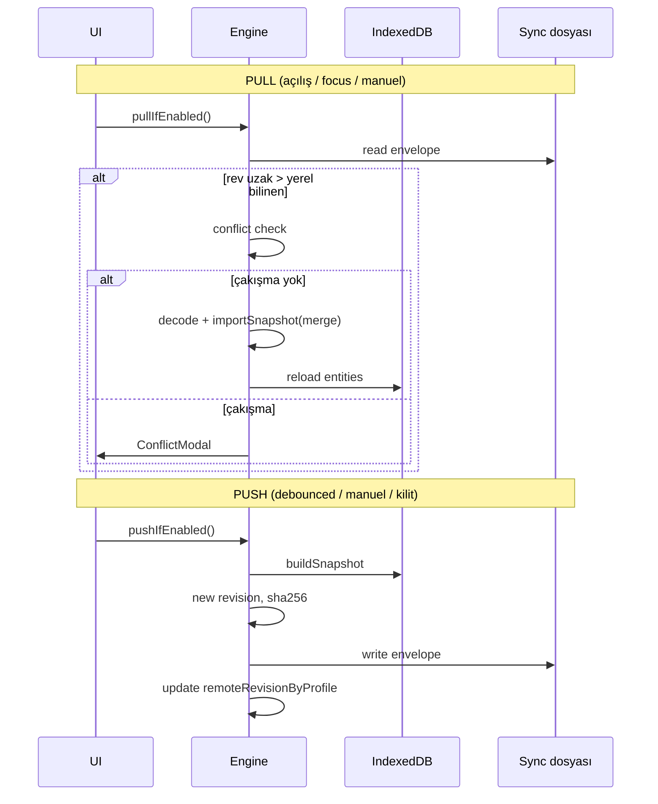

# Otomatik senkron dosyası — tasarım

Bu belge, **export/import dialog’undan bağımsız**, açılıp kapatılabilen **otomatik senkron dosyası** özelliğinin tasarımını tanımlar. Hedef: aynı `index.html` SPA’yı farklı tarayıcı/cihazda açan kullanıcının, kendi seçtiği senkron klasörü (iCloud Drive, Dropbox, Syncthing, Nextcloud client vb.) üzerinden profil verisini taşıması.

**Kısıtlar (değişmez):**

- Merkezi backend yok
- Offline-first bozulmaz (ağ zorunlu değil)
- Mevcut snapshot şifreleme ve hassas veri politikaları korunur
- `file://` dağıtımı desteklenmeye devam eder

---

## 1. Özet

| Konu | Karar |
|------|--------|
| Taşıma birimi | Tek dosya: `KurtarmaPlani.sync` (profil başına veya tüm profiller — bkz. §4) |
| İç format | Mevcut export zarfı + **senkron meta** üst bilgisi |
| Depolama yolu | Kullanıcı seçer; OS/bulut istemcisi dosyayı cihazlar arası taşır |
| Tarayıcı API | **File System Access API** (tercih) + indir/yeniden-seç **fallback** |
| Çakışma (v1) | Otomatik birleştirme yok; kullanıcı **yerel / uzak** seçer |
| Kapsam (v1) | **Aktif profil** (mevcut `buildSnapshot` ile uyumlu) |
| Anahtar | Ayarlarda **açık / kapalı**; kapalıyken hiçbir I/O yok |

---

## 2. Kullanıcı deneyimi

### 2.1 Konum

**Ayarlar → Veri** sekmesi, `DataBackupSection` altında yeni kart: **Otomatik senkron**.

Manuel yedekleme (indir / dosya seç) aynen kalır; senkron ayrı bir blok.

### 2.2 Açma / kapama

```
[ ] Otomatik senkronu etkinleştir
```

| Durum | Davranış |
|-------|----------|
| **Kapalı (varsayılan)** | Dosya izleme yok, debounced yazma yok, pull yok. Ayarlar (dosya adı, şifreleme tercihi) saklanabilir ama handle temizlenir. |
| **Açık** | İlk açılışta veya handle geçersizse **senkron dosyası seç** / **oluştur** sihirbazı. Sonrasında push/pull devreye girer. |
| **Kapatma** | Onay: *«Yerel veri silinmez; uzak dosya güncellenmeyi durdurur.»* Watchers durdurulur; `FileSystemFileHandle` serbest bırakılır. |

### 2.3 Alt seçenekler (yalnızca açıkken)

| Ayar | Varsayılan | Açıklama |
|------|------------|----------|
| Senkron dosyası | — | Göster: dosya adı + son yazma/okuma zamanı |
| Dosyayı şifrele | **Açık** | Export ile aynı `KP-ENC1` zarfı |
| Senkron parolası | Profil parolası / ayrı parola | Parolasız profilde ayrı parola **zorunlu** (şifreleme açıksa) |
| Hassas kayıtlar | Kapalı | Export ile aynı onay metni |
| AI anahtarları | Kapalı | Export ile aynı |
| Otomatik yazma | Açık | Kayıt sonrası debounced push |
| Şimdi senkronize et | Düğme | Anında pull → çakışma kontrolü → push |

### 2.4 Durum göstergesi

Navbar veya Veri kartında kısa rozet:

- **Senkron kapalı**
- **Güncel** (yerel rev = uzak rev)
- **Bekleyen yazma** (debounce kuyruğunda)
- **Uzak güncelleme var** (pull gerekli)
- **Çakışma** (kullanıcı kararı bekliyor)
- **Hata** (dosya erişimi, şifre, şema)

---

## 3. Mimari

```
┌─────────────────────────────────────────────────────────┐
│ UI: SyncSettingsSection (Ayarlar → Veri)                │
└───────────────────────────┬─────────────────────────────┘
                            │
┌───────────────────────────▼─────────────────────────────┐
│ store: useSyncStore (Pinia)                             │
│   enabled, settings, runtimeStatus, pendingConflict     │
└───────────────────────────┬─────────────────────────────┘
                            │
┌───────────────────────────▼─────────────────────────────┐
│ src/core/services/sync/                                 │
│   sync-file.ts      — okuma/yazma, handle yönetimi      │
│   sync-engine.ts    — push/pull, rev karşılaştırma      │
│   sync-conflict.ts  — çakışma tespiti + çözüm UI verisi │
│   sync-scheduler.ts — debounce, visibility, lock hooks    │
└─────┬───────────────────────────────┬───────────────────┘
      │                               │
      ▼                               ▼
 buildSnapshot / importSnapshot    AppMeta.sync + IndexedDB
      (mevcut)                      (handle persist)
```

**Finans/UI katmanına dokunulmaz:** `entities` store kayıt sonrası tek hook: `syncScheduler.notifyLocalChange()`.

---

## 4. Dosya formatı

Mevcut export zarfının üstüne **senkron üst bilgisi** eklenir. İki katman:

### 4.1 Dış zarf (`KP-SYNC1`)

Plain JSON (meta her zaman okunabilir — rev karşılaştırması şifre çözmeden yapılabilsin):

```typescript
interface SyncFileEnvelope {
  magic: 'KP-SYNC1'
  schemaVersion: number          // sync şema sürümü (1)
  /** İçerik KP-RAW1 veya KP-ENC1 — export ile aynı */
  contentMagic: 'KP-RAW1' | 'KP-ENC1'
  /** Profil kimliği (meta.password hariç ProfileMeta.id) */
  profileId: string
  profileName: string
  /** Monoton artan; her başarılı push'ta yeni ULID */
  revision: string
  /** Yazan cihaz — AppMeta'da kalıcı UUID */
  deviceId: string
  writtenAt: string              // ISO 8601
  /** İç snapshot'un SHA-256 (hex); bütünlük + hızlı eşitlik */
  contentSha256: string
  /** Şifreli ise dış meta yine plain; içerik KP-ENC1 */
  payload: string                // KP-RAW1 veya KP-ENC1 JSON string (tek satır)
}
```

**Neden ayrı magic?** Export dosyası ile karışmasın; senkron motoru dosyayı tanısın; pull sırasında rev/sha256 şifre çözmeden okunabilsin.

### 4.2 İç snapshot

Mevcut `ExportSnapshot` (`type: kurtarma-plani-export`). Ek alan **gerekmez** — senkron meta dış zarf ta taşınır.

### 4.3 Dosya adı

Varsayılan: `KurtarmaPlani-{profileSlug}.sync`  
Kullanıcı farklı ad seçebilir. Aynı iCloud klasöründe çok profil → profil başına ayrı dosya (v1).

---

## 5. Kalıcı ayarlar

### 5.1 `AppMeta` genişlemesi

Meta DB `version(4)` migration:

```typescript
interface AppMeta {
  // ... mevcut alanlar
  deviceId: string               // ilk kurulumda random UUID
  sync?: SyncConfig
}

interface SyncConfig {
  enabled: boolean
  /** File System Access API — IndexedDB'de serialize (Chromium) */
  fileHandle?: FileSystemFileHandle
  fileName?: string
  encryptFile: boolean
  /** syncPassword sadece encryptFile && !useProfilePassword ise localStorage DEĞİL — session veya prompt */
  useProfilePassword: boolean
  includeSensitive: boolean
  includeSecrets: boolean
  autoPush: boolean
  /** Profil id → son bilinen uzak rev */
  remoteRevisionByProfile: Record<string, string>
  lastSyncAt?: string
  lastError?: string
}
```

**Parola saklama:** Senkron parolası **IndexedDB’de düz metin olarak saklanmaz**. Seçenekler:

1. Profil açıkken profil anahtarı ile şifrele (parolalı profil)
2. Her push/pull öncesi kısa süreli prompt (parolasız profil + şifreli dosya)
3. İsteğe bağlı: oturum süresince `sessionStorage` (kullanıcı “bu oturumda hatırla” derse)

### 5.2 Yerel revizyon izleme

Profil meta veya ayrı meta satırı:

```typescript
interface ProfileSyncLocalState {
  profileId: string
  localRevision: string          // son başarılı push rev
  lastLocalMutationAt: string    // entity save/remove max(updatedAt)
  lastPullAt?: string
  lastPushAt?: string
}
```

`localRevision` yalnızca **başarılı push** sonrası artar. Yerel düzenleme `lastLocalMutationAt` günceller.

---

## 6. Push / pull akışı



### 6.1 Pull tetikleyicileri

- Profil kilidi açıldıktan sonra (sync enabled + handle valid)
- `document.visibilitychange` → `visible`
- Manuel «Senkronize et»
- **Değil:** periyodik polling (gereksiz; OS sync zaten dosyayı taşır)

### 6.2 Push tetikleyicileri

- `entities.save` / `remove` sonrası **debounce 2 sn** (`autoPush`)
- Profil **kilit** (`profileStore.lock`) öncesi flush
- Manuel «Senkronize et» (önce pull, sonra push)

### 6.3 Sıra kuralı

Her tam senkron: **pull → çakışma varsa dur → yoksa push**.  
Böylece uzak değişiklik yerel yazmadan ezilmez.

---

## 7. Çakışma politikası (v1)

**Çakışma** = hem yerel hem uzak, son senkronizasyondan sonra değişmiş.

```
uzak.revision ≠ local.remoteRevision  AND
lastLocalMutationAt > lastPushAt
```

Modal seçenekleri:

| Seçenek | Sonuç |
|---------|--------|
| **Uzak sürümü kullan** | `importSnapshot` (uzak); yerel değişiklikler kaybolur — kırmızı uyarı |
| **Yerel sürümü koru** | Push; uzak ezilir |
| **Vazgeç** | Durum `conflict` kalır; rozet uyarı verir |

**v2 (ileride):** entity düzeyinde `updatedAt` birleştirme (aynı id → en yeni kazanır); finans uygulamasında v1’de kullanıcı onayı şart.

Import politika: mevcut `importSnapshot` + **aynı profil id** → entity replace; farklı id → yeni profil (manuel export/import ile aynı).

---

## 8. Tarayıcı ve platform

| Ortam | Push/pull |
|-------|-----------|
| Chrome / Edge (masaüstü) | `showSaveFilePicker` + handle IndexedDB persist |
| Firefox | FS Access sınırlı → fallback: indir + «dosyayı güncelle» talimatı veya her seferinde `showOpenFilePicker` |
| Safari | FS Access yok → fallback zorunlu |
| `file://` | Senkron **açılabilir** ama klasör seçimi OS diyaloguna bağlı; Safari/file://’de «Manuel dosya güncelle» UX |

### 8.1 Fallback modu

`syncMode: 'handle' | 'manual'`

- **handle:** otomatik read/write
- **manual:** push → indirilen dosyayı kullanıcı senkron klasörüne koyar; pull → «Güncel dosyayı seç»

---

## 9. Güvenlik

- Senkron dosyası iCloud/Dropbox’ta **düz metin finans verisi** taşımamalı → varsayılan şifreli
- Hassas / API anahtarı dahil etme export ile **aynı onay** metinleri
- AI snapshot’a senkron meta **dahil edilmez**
- `contentSha256` manipülasyon tespiti (decode sonrası doğrula)
- Hata mesajlarında parola/sync içeriği loglanmaz

---

## 10. Modül ve dosya planı

```
src/core/types/sync.ts              SyncConfig, SyncFileEnvelope, Zod
src/core/services/sync/
  sync-file.ts                        read/write envelope, handle store
  sync-engine.ts                      pull, push, compareRevision
  sync-conflict.ts                    detect + resolve helpers
  sync-scheduler.ts                   debounce, visibility, entity hook
src/stores/sync.ts                    Pinia: enabled, status, runSync
src/components/SyncSettingsSection.vue
src/core/db/meta.ts                   v4 migration: AppMeta.sync, deviceId
```

**Test (Vitest):**

- `sync-conflict.spec.ts` — çakışma koşulları
- `sync-envelope.spec.ts` — round-trip, sha256, Zod
- `sync-engine.spec.ts` — mock file + importSnapshot entegrasyonu

---

## 11. Uygulama fazları

| Faz | Kapsam |
|-----|--------|
| **S1** | Tipler + Zod + `SyncSettingsSection` UI (toggle kapalıyken sadece ayar) |
| **S2** | `sync-file` write/read + manuel «Senkronize et» (handle modu) |
| **S3** | Debounced auto-push + pull on focus + profil lock flush |
| **S4** | Çakışma modal + durum rozeti |
| **S5** | Manual fallback mod + Safari/file:// UX metinleri |
| **S6** | (Opsiyonel) WebDAV profili — aynı envelope, farklı transport |

---

## 12. Bilinçli kapsam dışı (v1)

- Gerçek zamanlı çoklu cihaz (WebSocket / WebRTC)
- CRDT / otomatik entity merge
- Tüm profilleri tek dosyada (v2 değerlendirmesi)
- Arka planda Service Worker sync (sunucu gerektirir)

---

## 13. İlgili kod

| Alan | Dosya |
|------|--------|
| Snapshot üretimi | `src/core/services/snapshot.ts` |
| Import | `src/core/services/snapshot-import.ts` |
| Export UI | `src/components/DataBackupSection.vue` |
| Meta DB | `src/core/db/meta.ts` |
| Mimari özet | `docs/ARCHITECTURE.md` |
