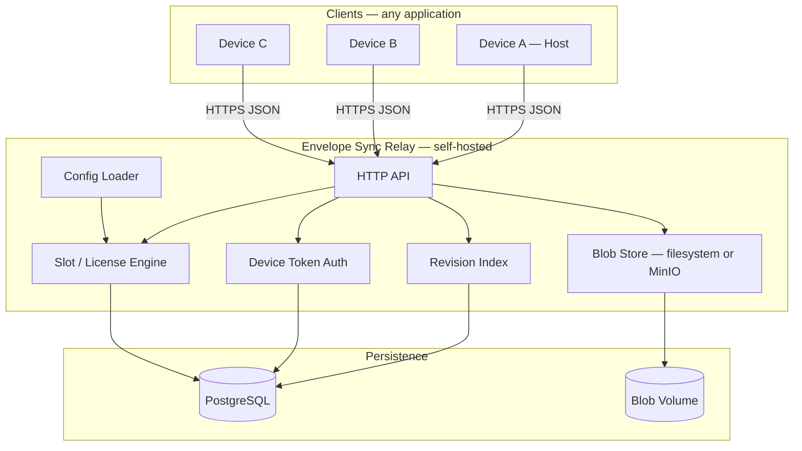
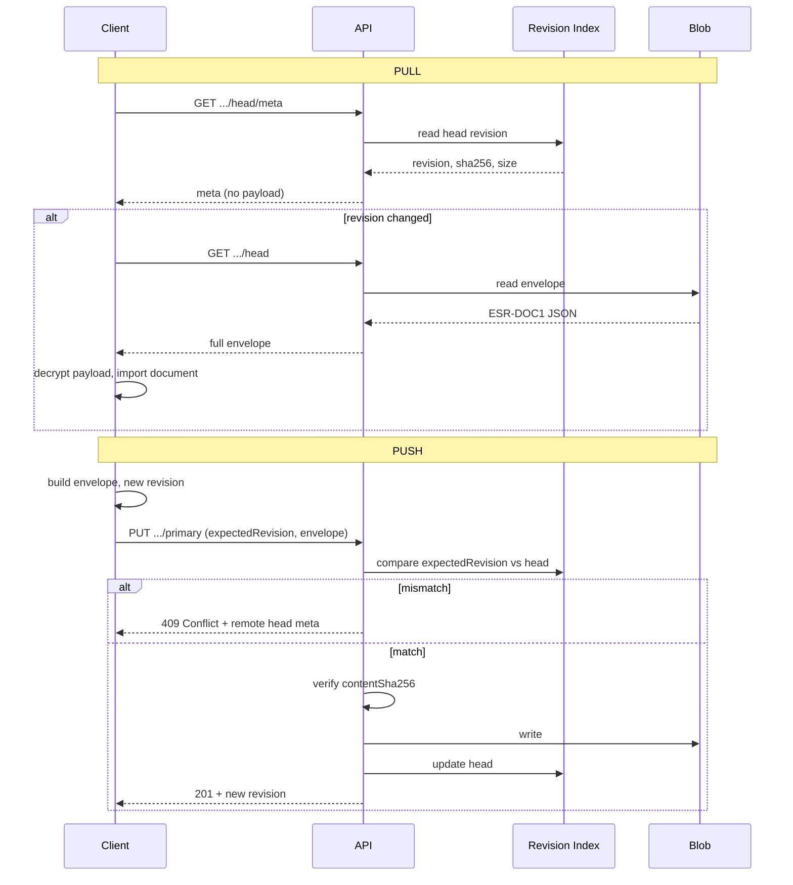
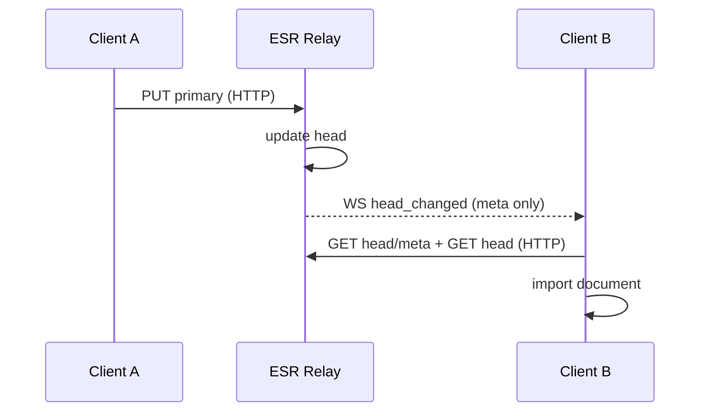

# 02 — Mimari

## 1. Sistem diyagramı



## 2. Bileşen sorumlulukları

### 2.1 HTTP API

- REST `/v1/*`
- JSON request/response
- `Authorization: Bearer <device_token>` (namespace işlemleri)
- `Authorization: Bearer <admin_token>` (admin işlemleri — opsiyonel MVP)

### 2.2 Device Token Auth

- Her eşleşmiş cihaz uzun ömürlü opaque token alır
- Sunucu yalnızca `SHA-256(token)` saklar
- Token namespace'e bağlı; başka namespace'te geçersiz

### 2.3 Slot / License Engine

- `max_devices = free_limit + purchased_slots`
- Pairing öncesi slot kontrolü
- Unlock kodu doğrulama ve `purchased_slots` artırma
- Operatör config: `on_limit_reached.mode`

### 2.4 Revision Index

- Namespace + document başına tek **head** revision
- Append-only revision geçmişi (MVP: head yeterli; geçmiş opsiyonel)
- Optimistic concurrency: `expectedRevision` / `If-Match`

### 2.5 Blob Store

- İçerik: serialize edilmiş `ESR-DOC1` envelope (tam JSON) veya yalnızca payload
- **Önerilen MVP:** Tüm envelope JSON blob olarak saklanır (basit debug, tek okuma)
- Blob key: `{namespace_id}/primary/{revision}.json` veya content hash

### 2.6 Config Loader

- YAML veya env tabanlı
- Hot reload opsiyonel (MVP: restart yeterli)

## 3. Push / Pull akışı



## 4. Sync döngüsü kuralı

Tam senkron (manuel veya otomatik):

```
1. GET head/meta
2. IF remote revision != known: GET head → import (conflict check client-side)
3. IF local changes: PUT primary (expectedRevision = last known remote)
4. IF 409: conflict UI — remote wins | local wins | cancel
```

Sunucu otomatik pull/push tetiklemez; istemci sorumludur. **WebSocket (v1.1):** sunucu `head_changed` yayınlar; istemci yine HTTP pull yapar (doc 13).

## 5. WebSocket bildirim katmanı (v1.1)



Ayrıntı: [13-WEBSOCKET-NOTIFICATIONS.md](./13-WEBSOCKET-NOTIFICATIONS.md)

## 6. Deployment topolojisi

### 6.1 Tek sunucu (MVP önerilen)

```
docker compose:
  - esr-api (Node/Bun/Go — implementer seçer)
  - postgres:16
  - volume: /data/blobs
```

Reverse proxy: Caddy veya nginx (TLS termination).

### 6.2 Minimum kaynak

| Ölçek | CPU | RAM | Disk |
|-------|-----|-----|------|
| MVP / kişisel | 1 vCPU | 512 MB | 10 GB + blob |
| 100 namespace | 2 vCPU | 1 GB | 50 GB |

### 6.3 Portlar

| Servis | Port |
|--------|------|
| API | 8080 (internal) |
| HTTPS | 443 (proxy) |
| Postgres | 5432 (internal only) |

## 7. Önerilen teknoloji yığını (implementer esnek)

| Katman | Öneri | Alternatif |
|--------|--------|------------|
| Runtime | Node 22 + TypeScript | Go, Rust |
| HTTP | Hono / Fastify | axum, chi |
| DB | PostgreSQL 16 | — |
| ORM | Drizzle / Kysely | sqlx |
| Validation | Zod | — |
| Blob | Local filesystem | MinIO S3 API |
| ID | ULID (`ulid` npm) | UUIDv7 |
| WS | `ws` veya `@hono/node-ws` | — |
| Tests | Vitest + supertest | pytest, go test |
| Container | Docker multi-stage | — |

**Zorunlu değil** — implementer eşdeğer seçebilir; API ve protokol sözleşmesi değişmemeli.

## 8. Repo yapısı (önerilen monorepo)

```
envelope-sync-relay/
├── packages/
│   ├── server/          # API + worker
│   ├── protocol/        # ESR-DOC1 Zod schemas, shared types
│   ├── client/          # Transport SDK (browser + node)
│   └── cli/             # admin: generate-unlock-code, migrate
├── docker/
│   ├── docker-compose.yml
│   └── Caddyfile
├── docs/                # bu spesifikasyon
├── openapi.yaml
└── package.json         # npm workspaces (optional)
```

## 9. İstemci SDK modülleri (evrensel)

```
@esr/protocol     — envelope parse/build/verify; kimlik: generateNamespaceId, generateRecoveryPhrase, buildRecoveryKeyProof
@esr/client       — EsrSync: varsayılan facade (doc 14) — connect, ensureNamespace, sync, pairing
@esr/client       — RelayClient + SyncEngine + NotificationClient: advanced / dahili
```

Uygulama yalnızca `DocumentAdapter` implement eder:

```typescript
interface DocumentAdapter {
  buildDocument(): Promise<string>       // inner payload JSON
  importDocument(payload: string): Promise<void>
  getEncryptionOptions(): EncryptionOptions
}
```

## 10. Namespace izolasyonu

- `namespaceId` UUID v4 — global benzersiz; tek relay instance'da çakışma yok
- DB: `namespace_id` unique constraint
- Blob path prefix: `namespace_id`
- Uygulama ayrımı: envelope `contentType` + operatörün deploy ettiği relay URL
- Rate limit namespace veya IP başına (opsiyonel)

## 11. Gözlemlenebilirlik

| Metrik | Kaynak |
|--------|--------|
| `esr_push_total` | counter |
| `esr_pull_total` | counter |
| `esr_conflict_409_total` | counter |
| `esr_pairing_total` | counter |
| `esr_ws_connections` | gauge |
| `esr_ws_notifications_total` | counter |

Log: structured JSON; **payload/envelope body asla loglanmaz**.

Health: `GET /health` → `{ "status": "ok", "db": "ok", "blob": "ok", "websocket": "enabled"|"disabled" }`
