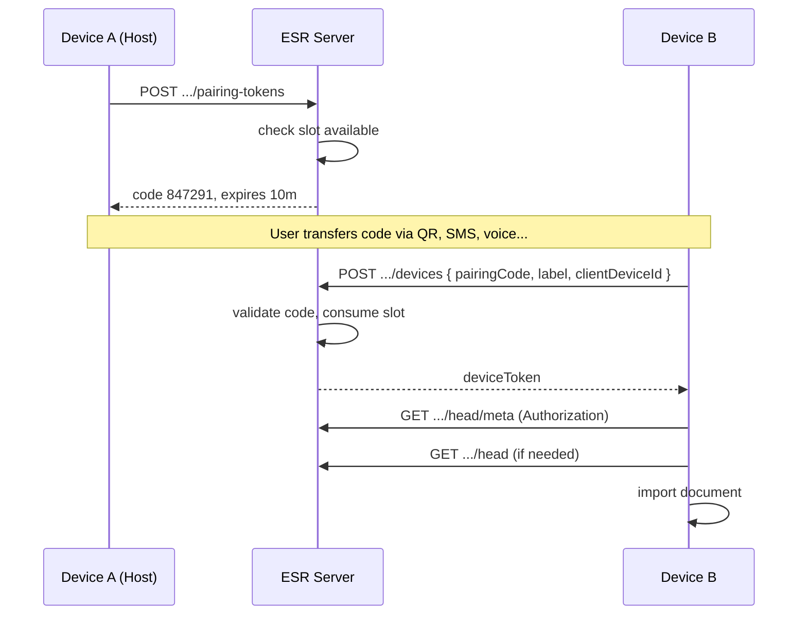
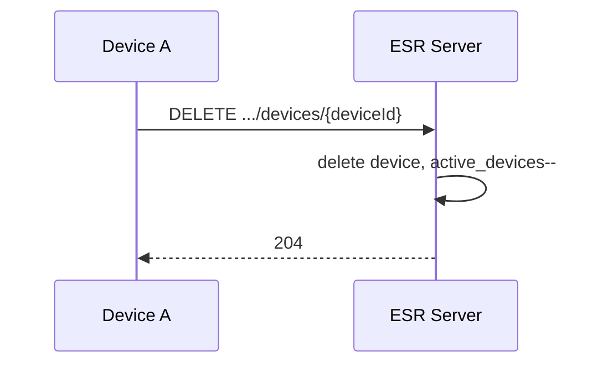

# 05 — Cihaz Eşleştirme ve Recovery

## 1. Kimlik modeli (kayıt yok)

ESR'de kullanıcı hesabı yoktur. Kimlik üç unsurla oluşur:

| Unsur | Amaç | Saklama |
|-------|------|---------|
| **namespaceId** | Veri kapsayıcısı | Sunucu DB |
| **device_token** | API erişimi | İstemci secure storage; sunucuda hash |
| **recovery phrase** | Felaket kurtarma | Yalnızca istemci / kullanıcı; sunucuda Argon2id hash |

## 2. Recovery key (C)

### 2.1 Üretim (istemci — zorunlu)

- **BIP39 İngilizce 24 kelime** — `@esr/protocol.generateRecoveryPhrase()` (uygulama/implementer kendi üretmez)
- Namespace create **öncesinde** istemci phrase üretir
- Kullanıcıya bir kez gösterilir; kopyalama onayı UI'da

`namespaceId` için uygulamanın sabit workspace/profil UUID'si yoksa `@esr/protocol.generateNamespaceId()` (UUID v4). Mevcut id varsa adapter döndürür; yine de `isValidNamespaceId()` ile doğrulanır (doc 09).

### 2.2 Sunucuya gönderim

Sunucu phrase **asla** görmez. İstemci `@esr/protocol.buildRecoveryKeyProof(phrase)` ile `recoveryKeyProof` üretir:

```typescript
import { generateRecoveryPhrase, buildRecoveryKeyProof } from '@esr/protocol'

const recoveryPhrase = generateRecoveryPhrase()
const recoveryKeyProof = await buildRecoveryKeyProof(recoveryPhrase)
// POST namespace create: { recoveryKeyProof: { salt, hash } }
```

Argon2id parametreleri (SSOT — `packages/protocol/src/identity.ts`):

| Parametre | Değer |
|-----------|--------|
| memoryCost | 65536 (64 MiB) |
| timeCost | 3 |
| parallelism | 4 |
| hashLength | 32 |
| salt | 16 byte random |

### 2.3 Recovery doğrulama

Recover endpoint'te istemci aynı phrase ile proof üretir; sunucu stored salt+hash ile verify eder.

**Başarısız:** 401 `RECOVERY_INVALID`

Rate limit: 5/saat/namespace (brute force koruması).

### 2.4 Recovery sonrası durum

| Alan | Davranış |
|------|----------|
| devices | Tümü silinir (token invalidate) |
| purchased_slots | **Korunur** |
| free_device_limit | Korunur |
| blob / head revision | **Korunur** |
| pairing tokens | Tümü iptal |

Yeni host tek cihaz olarak başlar; kullanıcı diğer cihazları yeniden pairing ile ekler.

## 3. Cihaz eşleştirme (B)

### 3.1 Akış diyagramı



### 3.2 Pairing code kuralları

| Kural | Değer |
|-------|--------|
| Format | 6 digit numeric |
| Entropy | crypto random, 000000-999999 |
| TTL | Default 600s, max 3600s |
| Kullanım | Tek redeem |
| Invalidation | Redeem, TTL, veya yeni token (opsiyonel: eski iptal) |

Brute force: 6 digit → rate limit IP + namespace; 10 failed → 15 dk lock.

### 3.3 QR payload format

```
esr://pair/v1/{namespaceId}?code={code}&exp={unix}&host={urlEncodedLabel}
```

İstemci QR encode/decode implement eder; sunucu yalnızca `code` doğrular.

### 3.4 clientDeviceId vs server deviceId

| ID | Kaynak | Kullanım |
|----|--------|----------|
| `clientDeviceId` | İstemci kalıcı UUID | Envelope `deviceId`, UI "bu cihaz" |
| `deviceId` (server) | ULID | API path, revoke target |

Eşleme: DB'de `(namespace_id, client_device_id)` unique — aynı fiziksel cihaz re-pair'de eski kayıt replace veya reject (tercih: **eski device revoke + yeni slot** aynı clientDeviceId için slot sayısı değişmez).

**Re-pair politikası (önerilen):**

```
IF clientDeviceId already paired:
  revoke old device row (same slot)
  create new device_token
ELSE:
  consume new slot if under limit
```

## 4. Cihaz kaldırma



### 4.1 Kurallar

- Kaldırma slot'u **anında** boşaltır
- Başka cihaz pairing → boş slot kullanır, **ek ödeme yok**
- Son cihaz kaldırılamaz → `LAST_DEVICE_PROTECTED`
- Kaldırılan cihazın token'ı anında geçersiz

### 4.2 Kim kimi kaldırabilir (MVP)

Her authenticated device aynı namespace'teki **herhangi bir** cihazı kaldırabilir (evrensel basitlik).

v2 opsiyon: yalnızca host veya `canManageDevices` flag.

## 5. Host kavramı

- İlk create eden cihaz otomatik host sayılır (`is_host: true` DB flag)
- Host'un ek yetkisi MVP'de **yok** (pairing her cihaz yapabilir)
- Recovery sonrası yeni cihaz host olur

## 6. device_token güvenliği

| Konu | Uygulama |
|------|----------|
| Üretim | 32 byte random, base64url |
| Saklama (sunucu) | SHA-256(token), never plaintext |
| Saklama (istemci) | localStorage / secure storage / OS keychain wrapper |
| Taşıma | HTTPS only |
| Rotation | Re-pair veya recovery |

Token sızdı → başka cihaz token sahibi o cihazı DELETE edebilir.

## 7. Slot kontrolü pairing'de

Pairing token **oluşturma** ve device **ekleme** öncesi:

```typescript
if (activeDevices >= maxDevices) {
  if (config.onLimitReached.mode === 'payment') {
    throw DEVICE_LIMIT_PAYMENT_REQUIRED
  } else {
    throw DEVICE_LIMIT_BLOCKED
  }
}
```

**Önemli:** Token oluşturma da slot gerektirir — limit doluyken host yeni kod üretemez (kullanıcı unlock sonrası devam eder).

## 8. İstemci durum makinesi

```
[unpaired]
   │ create namespace OR recover OR pair
   ▼
[paired]
   │ sync enabled
   ├─► [syncing]
   ├─► [conflict]
   └─► [limit_blocked]

[paired] ── revoke self ──► [unpaired] (local data remains app responsibility)
```

## 9. İstemci depolama (önerilen anahtarlar)

| Key | İçerik |
|-----|--------|
| `esr.relayUrl` | Sunucu base URL |
| `esr.namespaceId` | Namespace UUID |
| `esr.deviceToken` | Bearer token |
| `esr.clientDeviceId` | Kalıcı cihaz UUID |
| `esr.knownRemoteRevision` | Son bilinen head revision |
| `esr.lastPushAt` | ISO timestamp |
| `esr.lastLocalMutationAt` | ISO timestamp |

Recovery phrase: **ayrı** güvenli kanal (password manager export); `esr.*` ile karıştırılmaz.

## 10. Test senaryoları (zorunlu)

1. Create → 1 device, limits correct
2. Pair 2nd device within free limit → success
3. Pair 3rd at limit, mode=block → 403
4. Pair 3rd at limit, mode=payment → 403, unlock → pair success
5. Revoke device → active decreases → pair new without payment
6. Recovery → all tokens invalid, slots preserved, head preserved
7. Wrong recovery → 401
8. Expired pairing code → 400
9. Re-pair same clientDeviceId → slot count unchanged
10. DELETE last device → 403 LAST_DEVICE_PROTECTED
