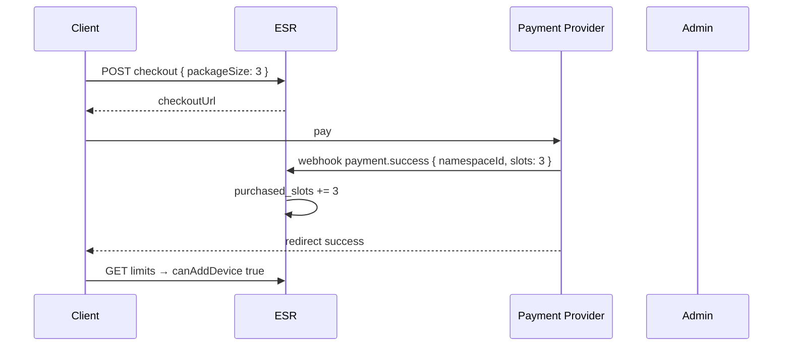

# 06 — Slot Lisanslama (Kayıt Yok)

## 1. Model özeti

ESR gelir/limit modeli **kullanıcı hesabı olmadan** namespace (veri kapsayıcısı) bazında çalışır.

```
max_devices = free_device_limit + purchased_slots
active_devices = şu an eşleşik cihaz sayısı

can_add_device = active_devices < max_devices
```

| Kavram | Açıklama |
|--------|----------|
| **free_device_limit** | Operatör config; ödeme olmadan eşzamanlı cihaz tavanı |
| **purchased_slots** | Unlock kodu / ödeme ile eklenen slot; **birikimli** |
| **Slot** | Eşzamanlı aktif cihaz hakkı; cihaz kaldırılınca geri gelir |
| **Tek seferlik ödeme** | Abonelik yok; limit doldukça yeni paket satın alınır |

## 2. Limit dolunca davranış

Operatör `on_limit_reached.mode` ile seçer:

### 2.1 `payment`

```
active_devices >= max_devices
  → pairing token: 403 DEVICE_LIMIT_PAYMENT_REQUIRED
  → POST devices: 403 DEVICE_LIMIT_PAYMENT_REQUIRED
  → response.details.slotPackages: [3, 5, 10]
```

İstemci unlock kodu veya checkout URL sunar.

### 2.2 `block`

```
active_devices >= max_devices
  → 403 DEVICE_LIMIT_BLOCKED
  → ödeme UI sunulmaz
  → kullanıcı cihaz kaldırarak slot açabilir
```

## 3. Slot paketleri

Config:

```yaml
slot_packages: [3, 5, 10]
```

- Paket boyutu = eklenecek `purchased_slots` miktarı
- Fiyatlandırma sunucu dışında (Stripe/Iyzico/manual); ESR yalnızca slot artırır
- Aynı namespace'e birden fazla paket uygulanabilir (birikimli):

```
free=2, purchased=0, max=2
  → unlock +3 → purchased=3, max=5
  → unlock +5 → purchased=8, max=10
```

## 4. Ödeme döngüsü

Kullanıcı 5 cihaz slot'unu doldurdu (5 eşleşik cihaz). 6. cihaz eklemek istiyor:

```
mode=payment:
  1. API 403 DEVICE_LIMIT_PAYMENT_REQUIRED
  2. Kullanıcı paket satın alır (örn. +3 slot)
  3. purchased_slots += 3 → max=8
  4. Pairing devam eder (6., 7., 8. cihaz)
  5. 8 dolunca döngü tekrarlar

mode=block:
  1. API 403 DEVICE_LIMIT_BLOCKED
  2. Kullanıcı bir cihaz kaldırır → max hâlâ 5 ama active=4
  3. Yeni cihaz ekleyebilir (ödeme yok)
```

**Slot geri kazanımı:** Cihaz kaldırma `active_devices--` yapar; `purchased_slots` değişmez. Boş slot başka cihazda **ücretsiz** kullanılır.

## 5. Unlock kodu formatı

### 5.1 Yapı

```
ESR-UNLK-{slots}-{signature}
```

Örnek: `ESR-UNLK-3-K7M9P2Q4R6T8`

| Parça | Açıklama |
|-------|----------|
| `ESR-UNLK` | Sabit prefix |
| `{slots}` | 1-999 integer |
| `{signature}` | HMAC veya base32 encoded imza |

### 5.2 Üretim (sunucu / admin CLI)

```typescript
function generateUnlockCode(slots: number, namespaceId: string, secret: string): string {
  const payload = `${namespaceId}:${slots}:${Date.now()}`
  const sig = hmacSha256(secret, payload).slice(0, 12) // base32 encode
  return `ESR-UNLK-${slots}-${toBase32(sig)}`
}
```

**Alternatif (daha basit MVP):** Kod DB'de random unique; imza yok; redeem tablosu.

```sql
unlock_codes (
  code TEXT PRIMARY KEY,
  namespace_id, slots, expires_at, redeemed_at
)
```

### 5.3 Redeem kuralları

- Kod namespace'e bağlı veya namespace redeem sırasında bağlanır (tercih: **admin üretirken namespace zorunlu**)
- Tek kullanımlık → `UNLOCK_CODE_ALREADY_REDEEMED`
- Süresi dolmuş → `UNLOCK_CODE_INVALID`
- Redeem sonrası: `purchased_slots += code.slots`

### 5.4 İstemci akışı

```
403 DEVICE_LIMIT_PAYMENT_REQUIRED
  → Modal: "3 cihaz slotu — [Satın al] [Kod gir]"
  → Satın al: checkout URL → webhook/admin → kod veya otomatik slot
  → Kod gir: POST /unlock
  → Retry pairing
```

## 6. Ödeme entegrasyonu (opsiyonel Faz 2)

ESR core ödeme işlemez; webhook adapter:



Webhook güvenliği: HMAC signature, idempotency key.

**MVP:** Admin CLI manuel unlock code; checkout webhook yok.

## 7. Namespace bazında override

Operatör VIP veya test için:

```yaml
# admin PATCH veya DB
namespace_overrides:
  "550e8400-...":
    free_device_limit: 10
    purchased_slots: 0
```

Efektif:

```
free = override.free ?? server.default_free_device_limit
max = free + purchased_slots
```

## 8. free_device_limit ilk tetikleme

"İlk tetikleme ayarlanabilir" = operatör `default_free_device_limit` belirler.

| Config | Davranış |
|--------|----------|
| `default_free_device_limit: 1` | 2. cihazda limit |
| `default_free_device_limit: 2` | 3. cihazda limit |
| `default_free_device_limit: 0` | 1. cihazdan sonra ödeme/block |

Namespace create sırasında `free_device_limit` snapshot alınabilir (grandfather): değişen global config eski namespace'i etkilemez (tercih: **evet, namespace row'da `free_device_limit` kopyala**).

## 9. Grandfathering politikası

| Senaryo | Önerilen |
|---------|----------|
| Global free limit düşürüldü | Mevcut namespace'lerde kayıtlı `free_device_limit` korunur |
| active > yeni max (nadir admin müdahalesi) | Yeni pairing yasak; mevcut cihazlar kalır |
| purchased_slots | Asla otomatik silinmez |

## 10. Audit

`unlock_events` tablosu (doc 10):

- namespace_id, slots_added, source (code|webhook|admin), created_at
- PII yok

## 11. Test senaryoları

1. free=2, 2 cihaz, mode=block → 3. cihaz 403 BLOCKED
2. free=2, unlock +3, max=5, 5 cihaz, mode=payment → 6. cihaz 403 PAYMENT
3. 5 cihaz, revoke 1, active=4 → 5. cihaz tekrar eklenebilir ödeme yok
4. unlock +3 twice → purchased=6 (birikimli)
5. invalid code → 400
6. redeem same code twice → 409 ALREADY_REDEEMED
7. recovery → purchased korunur
