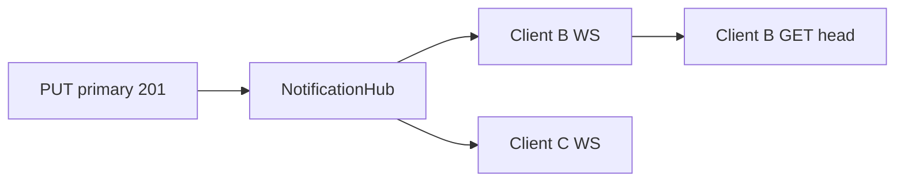

# 13 — WebSocket Bildirimleri

Bu belge, ESR'nin **push-to-pull** bildirim kanalını tanımlar. WebSocket **veri taşımaz**; yalnızca “uzak head değişti, HTTP pull yap” sinyali gönderir.

**Spec sürümü:** 1.1.0 (REST v1 ile birlikte; WS opsiyonel ama spec'te tanımlı)

---

## 1. Amaç ve sınırlar

| WebSocket yapar | WebSocket yapmaz |
|-----------------|------------------|
| `head_changed` meta broadcast | Snapshot / envelope gönderimi |
| `limits_changed` (slot unlock) | Conflict çözümü |
| Bağlantı canlılığı (ping/pong) | Entity merge |
| Pull tetikleme sinyali | Polling'i tamamen kaldırma |

**Altın kural:** Her bildirim sonrası istemci yine **HTTP GET head/meta → gerekirse GET head** çalıştırır. Tek sync kod yolu korunur.

---

## 2. Neden polling yeterli değildi?

HTTP-only modda Client B, Client A push ettikten sonra en geç ~45 sn (veya focus/visible) pull yapar. WebSocket ile gecikme **saniye altına** iner; pil tüketimi polling'den düşük olabilir (seyrek interval + anlık notify).

**Polling fallback zorunlu:** WS kapalı, proxy kopuk, sekmeler arka planda — `GET head/meta` yine periyodik veya visibility'de çalışır.

---

## 3. Endpoint

```
wss://{host}/v1/namespaces/{namespaceId}/notifications
```

| Özellik | Değer |
|---------|--------|
| Protokol | WebSocket (RFC 6455) |
| TLS | WSS zorunlu (production) |
| Subprotocol | `esr-notifications-v1` (Sec-WebSocket-Protocol) |
| Kimlik | `device_token` (REST ile aynı) |

### 3.1 Kimlik doğrulama (upgrade)

**Tercih edilen — Authorization header (RFC uyumlu proxy'ler):**

```http
GET /v1/namespaces/{namespaceId}/notifications HTTP/1.1
Host: sync.example.com
Upgrade: websocket
Connection: Upgrade
Sec-WebSocket-Protocol: esr-notifications-v1
Authorization: Bearer dvt_xxxxxxxx
```

**Alternatif — ilk mesaj (header taşınamayan ortamlar):**

Bağlantı açılır → istemci 5 sn içinde:

```json
{ "type": "auth", "token": "dvt_xxxxxxxx" }
```

Sunucu:

```json
{ "type": "auth_ok", "deviceId": "01JF...", "namespaceId": "..." }
```

veya bağlantı kapatılır (4401 custom code veya `auth_fail` + close).

**Query string token (`?token=`) production'da önerilmez** — access log sızıntısı.

---

## 4. Mesaj formatı

UTF-8 JSON text frame. Binary frame kullanılmaz (v1).

### 4.1 Sunucu → istemci

```typescript
type WsServerMessage =
  | {
      type: 'auth_ok'
      deviceId: string
      namespaceId: string
      serverTime: string // ISO 8601
    }
  | {
      type: 'head_changed'
      documentId: 'primary'
      revision: string
      contentSha256: string
      writtenAt: string
      writerDeviceId: string
    }
  | {
      type: 'limits_changed'
      maxDevices: number
      activeDevices: number
      purchasedSlots: number
    }
  | { type: 'ping'; ts: string }
  | {
      type: 'error'
      code: string
      message: string
    }
  | { type: 'auth_fail'; code: string; message: string }
```

### 4.2 İstemci → sunucu

```typescript
type WsClientMessage =
  | { type: 'auth'; token: string }           // yalnızca header auth yoksa
  | { type: 'pong'; ts: string }              // ping yanıtı
  | { type: 'subscribe'; documentId: 'primary' }  // opsiyonel; path yeterli v1
```

### 4.3 Zod (packages/protocol)

`WsServerMessageSchema`, `WsClientMessageSchema` — `@esr/protocol` içinde export.

---

## 5. Olay yayın kuralları

### 5.1 `head_changed`

**Ne zaman:** `PUT .../documents/primary` başarılı (201) sonrası.

**Kime:** Aynı `namespaceId`'ye abone tüm **açık WS bağlantıları** — push yapan cihaz dahil (istemci bilinen revision ile no-op).

**Payload:** `GET head/meta` ile aynı alanlar (+ `writerDeviceId`).

```typescript
hub.broadcast(namespaceId, {
  type: 'head_changed',
  documentId: 'primary',
  revision,
  contentSha256,
  writtenAt,
  writerDeviceId: envelope.deviceId,
})
```

### 5.2 `limits_changed`

**Ne zaman:**

- `POST .../unlock` başarılı
- Admin slot PATCH
- (Opsiyonel) device pair/revoke sonrası `canAddDevice` değiştiyse

**Kime:** Aynı namespace WS aboneleri.

### 5.3 `ping` / `pong`

- Sunucu her **30 sn** (config) `ping` gönderir
- İstemci **10 sn** içinde `pong` yoksa sunucu bağlantıyı kapatır
- İstemci son 60 sn ping görmediyse reconnect

---

## 6. İstemci davranışı (`@esr/client`)

### 6.1 NotificationClient

```typescript
interface NotificationClientOptions {
  baseUrl: string
  namespaceId: string
  getDeviceToken: () => string | undefined
  onHeadChanged: (meta: HeadChangedPayload) => void
  onLimitsChanged?: (limits: LimitsChangedPayload) => void
  /** WS yok veya kopukken polling aralığı (ms). Default 45_000 */
  pollIntervalMs?: number
  /** document.hidden iken WS kapat (pil). Default true */
  pauseWhenHidden?: boolean
}

interface NotificationHandle {
  connect(): void
  disconnect(): void
  readonly state: 'disconnected' | 'connecting' | 'connected' | 'paused'
}
```

### 6.2 `onHeadChanged` içinde

```typescript
onHeadChanged(meta) {
  if (meta.revision === knownRemoteRevision) return
  if (hasLocalChangesSinceLastPush()) {
    markConflictPending(meta)
    return
  }
  void relayClient.pullHead(namespaceId) // HTTP
}
```

Conflict ve pull mantığı **mevcut SyncEngine** ile aynı; WS yalnızca tetikleyici.

### 6.3 Reconnect

- Exponential backoff: 1s → 2s → 4s → … max 60s
- Jitter ±20%
- Reconnect sonrası **her zaman** `GET head/meta` (kaçırılan mesajlar)
- `navigator.onLine` false → disconnect; `online` → reconnect

### 6.4 Polling ile birlikte

```typescript
mode: 'ws_with_poll_fallback' // default
```

| WS durumu | Pull tetikleme |
|-----------|----------------|
| connected | `head_changed` + seyrek poll (örn. 5 dk) |
| disconnected | poll 45 sn + visibility/focus |
| disabled (server) | poll 45 sn only |

Operatör `websocket.enabled: false` ise istemci WS denemez.

---

## 7. Sunucu mimarisi



### 7.1 Tek process (MVP)

```typescript
class NotificationHub {
  private rooms = new Map<string, Set<WebSocket>>() // namespaceId → sockets

  subscribe(namespaceId: string, ws: WebSocket, deviceId: string): void
  unsubscribe(namespaceId: string, ws: WebSocket): void
  broadcast(namespaceId: string, message: WsServerMessage): void
}
```

Auth middleware: token → namespaceId path eşleşmesi zorunlu (başka namespace'e abone olamaz).

### 7.2 Çoklu instance (v1.1+ opsiyonel)

Redis pub/sub kanalı: `esr:notify:{namespaceId}`

Push handler → Redis publish → tüm API pod'ları local WS'lere iletir.

MVP'de **tek instance yeter**; docker-compose tek `api` servisi.

---

## 8. Yapılandırma

```yaml
websocket:
  enabled: true
  path: "/v1/namespaces/:namespaceId/notifications"  # sabit
  pingIntervalSeconds: 30
  pongTimeoutSeconds: 10
  maxConnectionsPerNamespace: 20
  maxConnectionsPerDevice: 3          # aynı cihaz çoklu sekme
```

Env:

```bash
ESR_WEBSOCKET_ENABLED=true
ESR_WS_PING_INTERVAL=30
```

### 8.1 Reverse proxy (Caddy)

```
sync.example.com {
  reverse_proxy api:8080
}
```

Caddy WebSocket upgrade otomatik. nginx için:

```nginx
proxy_http_version 1.1;
proxy_set_header Upgrade $http_upgrade;
proxy_set_header Connection "upgrade";
proxy_read_timeout 3600s;
```

---

## 9. Güvenlik

| Konu | Uygulama |
|------|----------|
| Auth | Aynı `device_token` hash DB |
| Namespace izolasyonu | Token yalnızca kendi namespace WS path'ine |
| Rate limit | Namespace başına max WS bağlantı |
| Log | WS frame body loglanmaz (head_changed meta loglanabilir — payload asla değil) |
| Revoke | Device revoke → sunucu ilgili WS'leri kapatır (4403) |

Custom close codes (öneri):

| Code | Anlam |
|------|--------|
| 4401 | Auth failed |
| 4403 | Device revoked |
| 4429 | Too many connections |

---

## 10. Hata kodları (WS `error` mesajı)

| code | Açıklama |
|------|----------|
| `WS_AUTH_REQUIRED` | İlk mesaj auth gelmedi |
| `WS_AUTH_INVALID` | Token geçersiz |
| `WS_NAMESPACE_MISMATCH` | Path vs token namespace |
| `WS_DISABLED` | Sunucuda WS kapalı |

HTTP `GET /health` yanıtına eklenebilir:

```json
{ "websocket": "enabled" }
```

---

## 11. Test senaryoları

1. A push → B WS `head_changed` → B HTTP pull → veri eşit
2. B offline WS → A push → B reconnect → head/meta catch-up
3. Revoke device → WS close 4403
4. `websocket.enabled: false` → client poll only, no WS upgrade
5. Ping timeout → reconnect
6. Conflict: B local edit + `head_changed` → conflict UI, otomatik pull yok
7. A push → A da `head_changed` alır → revision biliniyorsa no-op

---

## 12. OpenAPI notu

WebSocket uçları OpenAPI 3.x ile tam modellenmez. Bu belge + `@esr/protocol` Zod şemaları SSOT. `openapi.yaml` `info.description` altında WS URL referansı bulunur.

---

## 13. Uygulama fazı

`11-IMPLEMENTATION-PLAN.md` **Faz 7b — WebSocket** (REST MVP sonrası, v1.1):

- [ ] NotificationHub + WS route
- [ ] PUT primary → broadcast
- [ ] `@esr/client` NotificationClient
- [ ] SyncEngine `ws_with_poll_fallback`
- [ ] Proxy config örneği
- [ ] Integration test: iki mock client

---

## 14. Bilinçli kapsam dışı

- Snapshot over WS
- Server-initiated push (HTTP PUT sunucudan)
- GraphQL subscription
- WebRTC
